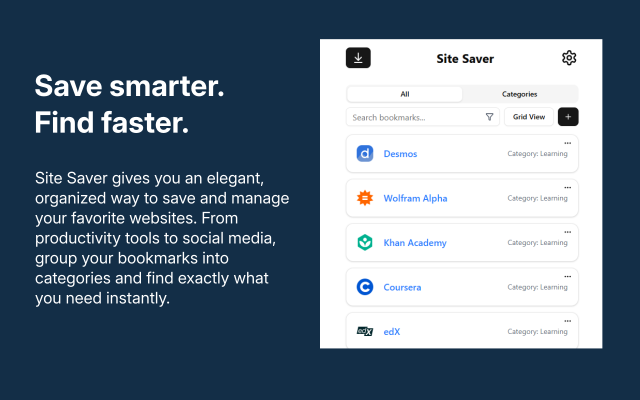
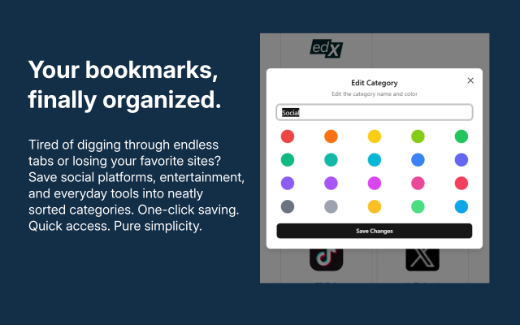
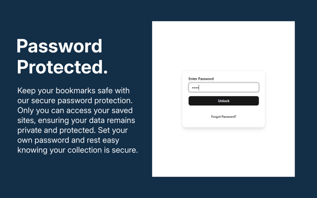

# 📌 Smart Bookmark Manager

A beautifully simple and customizable Chrome extension for saving, organizing, and accessing your favorite sites. Perfect for students, professionals, and anyone who wants a better way to manage their web life.

---

## 🔥 Features

-   🧠 **Smart Saving** – Auto-fill titles, prevent duplicates, and save pages with one click.
-   🎨 **Customizable UI** – Switch between grid or list view, and more.
-   🗂️ **Category Management** – Organize bookmarks into customizable categories.

---

## 📷 Screenshots







---

## 🚀 Installation

Local Install

1. Clone or download this repository.
2. Go to `chrome://extensions/` in your Chrome browser.
3. Enable **Developer mode** (top right).
4. Click **Load unpacked** and select the /dist folder.
5. Start saving your favorite pages!

or

Web Store

1. Download and install the extension from the Chrome Web Store; Search: Site Saver.
2. Once installed, click on the extension icon in your browser toolbar to start using Site Saver.
3. Use the service directly in the extension popup for quick and organized bookmarks.

---

## 🛠️ Tech Stack

-   React + TypeScript
-   ShadCN UI (Radix + Tailwind CSS)
-   Chrome Extension API
-   Vite

---

## 🧪 Development

```bash
# 1. Clone the repository
git clone https://github.com/chrisdiprima/Bookmark-Vault.git

# 2. Navigate into the project directory
cd Bookmark-Vault

# 3. Install dependencies
npm install

# 4. Start the development server (for popup/options page development)
npm run dev

# 5. Build the extension for Chrome
npm run build
```
